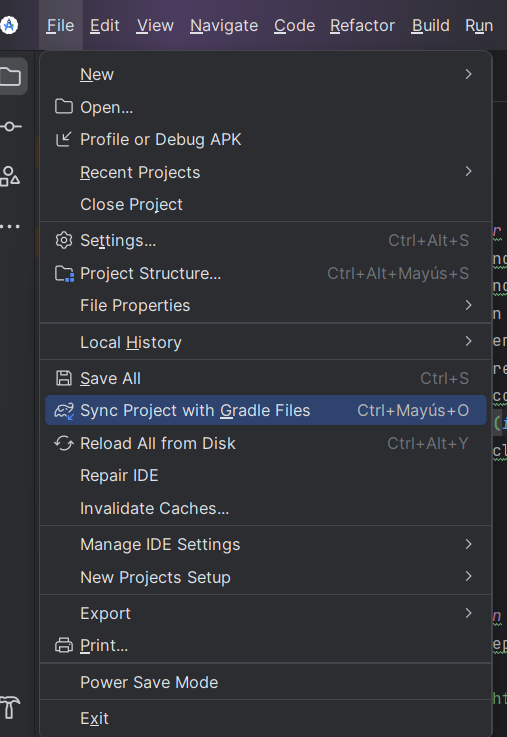

# AlarmPill

## Descripción

es una aplicación integral, disponible tanto en móvil como en web, diseñada para optimizar la gestión de recordatorios de medicamentos. La app móvil permite a los usuarios crear, editar y eliminar recordatorios manualmente o mediante comandos de voz. La integración entre ambas plataformas garantiza una experiencia fluida y eficiente en la administración de la medicación.
La versión web ofrece funcionalidades adicionales para registrar, listar y gestionar medicamentos y vías de administración en una base de datos sincronizada.


## Tabla de Contenidos
- [Características](#características)
- [Flujo de la Aplicación con las 6 pantallas](#flujo-de-la-aplicación)
- [Imágenes de Pantalla](#imágenes-de-pantalla)
- [Como correr la App desde un emulador](#como-correr-la-App-desde-un-emulador)
- [Instalación apk](#instalación)
- [Contribuciones](#contribuciones)

---

## Características
es una aplicación integral, disponible tanto en móvil como en web, diseñada para optimizar la gestión de recordatorios de medicamentos. La app móvil permite a los usuarios crear, editar y eliminar recordatorios manualmente o mediante comandos de voz. La integración entre ambas plataformas garantiza una experiencia fluida y eficiente en la administración de la medicación.
La versión web ofrece funcionalidades adicionales para registrar, listar y gestionar medicamentos y vías de administración en una base de datos sincronizada.

---

## Flujo de la Aplicación
1. **Pantalla de Crear alarma - Inicio**: Muestra el logo de la aplicación y el botón Comencemos.
2. **Pantalla Crear alarma - Recordatorios**: Permite al usuario seleccionar entre las dos opciones para crear alarma por formulario y por voz. En ese caso solo esta habilitado por formulario.
3. **Pantalla Crear alarma - Registrar medicamentos**: Permite al usuario ingresar el nombre del medicamento.
4. **Pantalla Crear alarma - Cantidad registrada**: Permite al usuario ingresar la cantidad total del medicamento y su presentación.
5. **Pantalla Crear alarma - Registrar Frecuencia**: Permite al usuario ingresar la frecuencia con la que toma el medicamento.
6. **Pantalla Ingrese la duración del tratamiento en días.**: Permite al usuario ingresar la duración del tratamiento en días.

---

## Imágenes de Pantalla

### Pantalla de Crear alarma - Inicio
[(https://drive.google.com/file/d/1KHHzVNnTXWOlSlVNBlPYJlchJ01xnVbb/view?usp=drive_link)](https://drive.google.com/file/d/1KHHzVNnTXWOlSlVNBlPYJlchJ01xnVbb/view?usp=drive_link)

### Pantalla Crear alarma - Recordatorios
[https://drive.google.com/file/d/1GSzImlddf5mZVoiBVWQJmwN9w93zRg4u/view?usp=drive_link](https://drive.google.com/file/d/1GSzImlddf5mZVoiBVWQJmwN9w93zRg4u/view?usp=drive_link)

### Pantalla Crear alarma - Registrar medicamentos
https://drive.google.com/file/d/1iwZuVxNp0mMR2viLbAICauMvxggZOPZD/view?usp=drive_link

### Pantalla Crear alarma - Cantidad registrada
https://drive.google.com/file/d/1PLrPKfZMOlkv5GWEk7HhGxVJg3QQ3uKp/view?usp=drive_link

### Pantalla Crear alarma - Registrar Frecuencia
https://drive.google.com/file/d/1z137AqCGHSL7i0dQiQMmScKHYVq27kDF/view?usp=drive_link

### Pantalla Ingrese la duración del tratamiento en días
https://drive.google.com/file/d/1NNlOQRqJ8pdh3jjblyAnInsDOLXJq_n-/view?usp=drive_link


---

## Como correr la App desde un emulador
1. Clona el repositorio:
   ```bash
   git clone https://github.com/milindr4123/AlarmPilll-UX.git
   ```
2. Se recomienda instalar Android Studio Koala Feature Drop | 2024.1.2 Patch 1.


3. Se recomienda hacer clic en: File → Sync Project with Gradle Files.


04. Haz clic en Device Manager en la parte lateral del IDE.


5. Luego, haz clic en Add a New Device.


6. Haz clic en Create Virtual Device.
7. Selecciona el dispositivo y haz clic en Siguiente hasta finalizar.


8. Finalmente, haz clic en Run.


---

## Instalación apk
1. Dentro de la ubicación: \app\debug\app-debug.apk
2. Descarga el APK en tu dispositivo.
3. Abre el APK. Puede que te aparezca la siguiente imagen, en cuyo caso debes seleccionar "Abrir  
4. Luego selecciona "Instalar"
   
5. Luego abrir
   
6. Finalmente, selecciona "Abrir".


